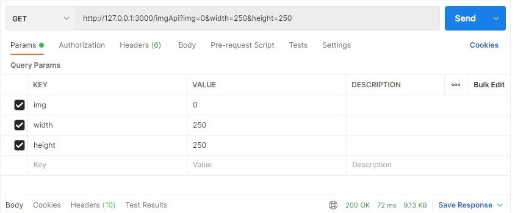

# Image Processing API

## About

Sharp.js based API for image resizing with request caching feature. Resizing images with sharp.js is 4x-5x faster than using the quickest ImageMagick and GraphicsMagick settings due to its use of [libvips](https://github.com/libvips/libvips).

#
## How  to Run:
Set up the API server:
```
git clone https://github.com/hashmi3/Image-Processing-API.git
cd Image-Processing-API
npm run start
```

#
## Request Parameters
Standard GET request: //http://127.0.0.1:3000/imgApi?img=[0-4]&width=[150-4096]&height=[150-2160]

img value less then 5 for picture number selection


